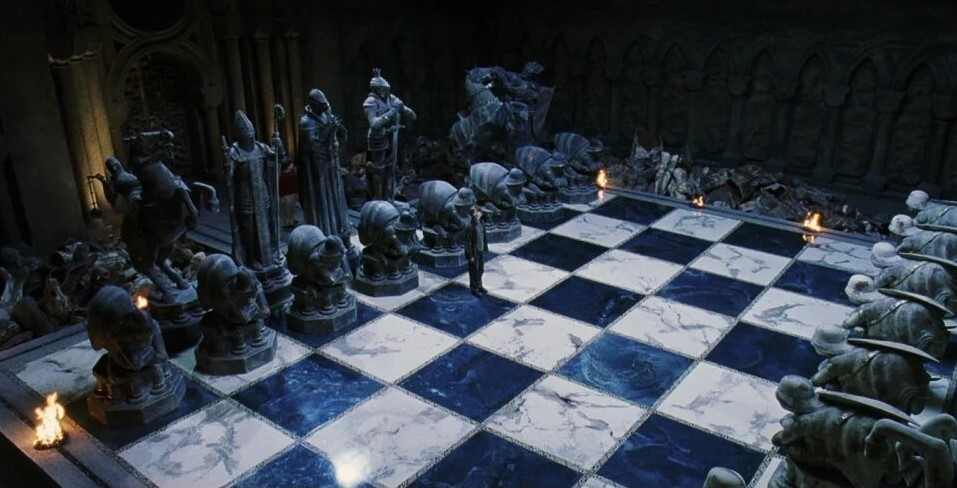
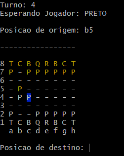
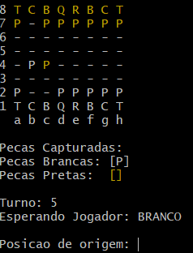
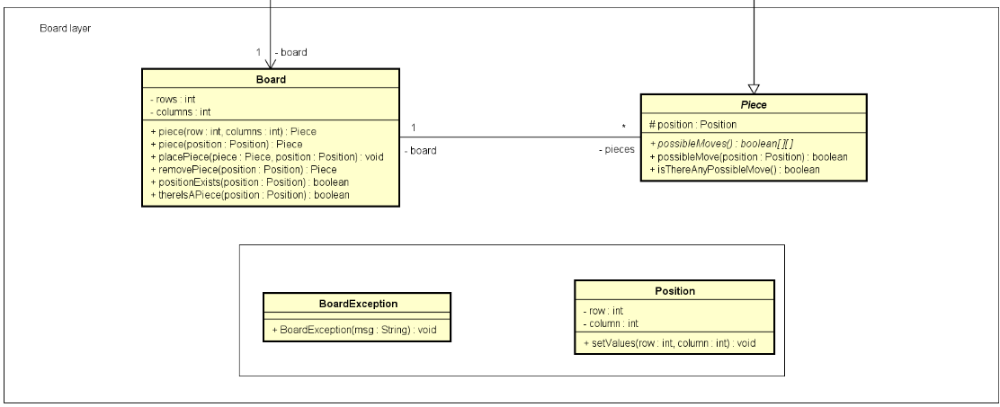
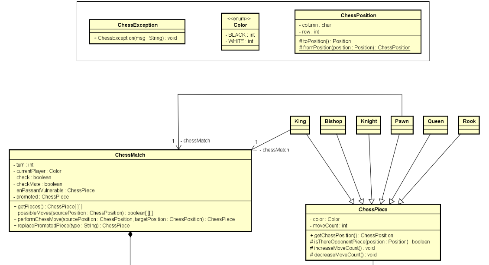
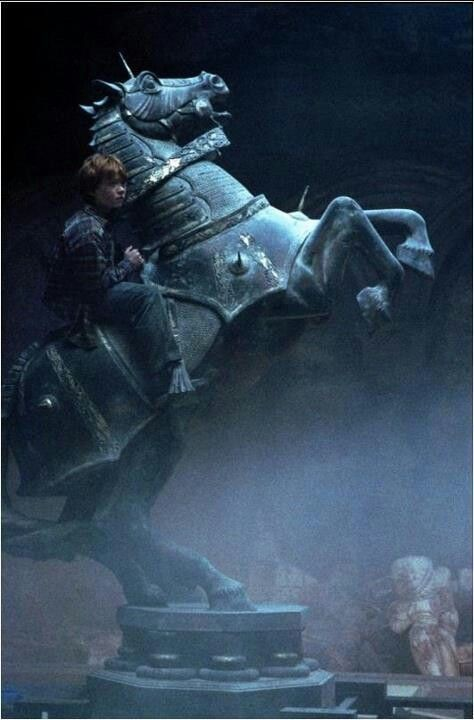
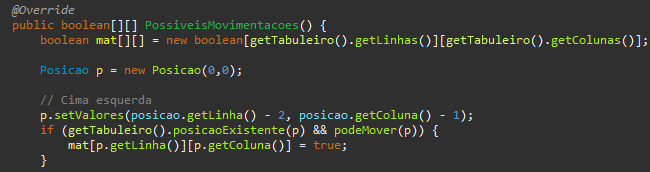
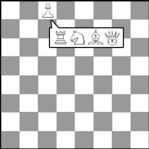

<h1 align= "center">Aprendendo a jogar adrez fazendo um jogo de xadrez ♟</h1>  
 

## Sobre
O projeto é um jogo de xadrez que pode ser jogado através de um prompt de comando com cores, tem todas a peças de xadrez e três jogadas principais. Fiz o projeto com Java sem o uso de bibliotecas ou frameworks adicionais, utilizando muito de orientação a objetos e estrutura de camadas.
  

  

 

  

 

## Por que jogo de xadrez?

Esse foi um dos primeiros projetos que eu vi feito pelo professor, [Nelio Alves](https://github.com/acenelio). Depois de estudar mais sobre POO eu senti que já estava um pouco mais confiante e fui fazendo o projeto seguindo o PDF que o professor disponibilizou.

O projeto em si não é difícil, assuntos de abstração, associações, herança, polimorfismo, encapsulamento, listas e estruturas não é o desafio do projeto e sim a sua arquitetura como as regras de negócios, estrutura desenvolvida por camadas e como os objetos se interagem, esse é o diferencial do projeto e o por que eu quis fazer ele. Nem os desafios do hackerrank me fez pensar tanto resolvendo os exercício do que este projeto 😂😂.

**obs: o projeto está todo em português para melhor compreensão do código**
 

## O que foi utilizado?
- Java
- padrão de camadas
- POO
  - associação
  - herança
  - polimorfismo
  - encapsulamento 
  - sobreposição
  - exceções
  - enumerações

## Arquitetura do projeto 
O projeto é feito em padrões de camadas, o que é excelente para o jogo de xadrez.

Existe a camada do tabuleiro, onde fica a estrutura do xadrez focada em características do tabuleiro: tabuleiro, peça (no tabuleiro), posição (do tabuleiro) e exceção do tabuleiro.

E a camada do xadrez que contém a maior parte do jogo em si, a parte geral como a cor, características da partida, peça de xadrez que contém métodos específicos como contagem de movimentações, posição do xadrez e partida de xadrez que obtém métodos de execução do jogo, testes de xeque e xeque-mate, passagem e finalização de partida, entre outros.

E também, dentro da camada de xadrez, há a classe de peças contendo cada peça do xadrez com suas devidas movimentações.

Todas essas camadas se relacionam usando muito bem o encapsulamento para não fazer modificações em camada distinta ou classes com usabilidade diferente. Foi fundamental praticar em exercícios e quebrar a cabeça no próprio projeto para entender como funciona.
 

## Peças e jogadas especiais
O projeto fica mais interessante quando chegamos nas peças. Cada peça tem sua própria regra de movimentação e captura.

### Cavalo

  

essa imagem é muito boa ☝🏽

O cavalo pode mover-se em forma de "L", duas casas em uma direção e uma casa perpendicular a essa direção, podendo saltar peças. Em cada classe contém a lógica de movimentação.

  

 

No código, é preciso verificar se existe a posição em uma matriz do tabuleiro, reduzindo a linha e a coluna dependendo da direção. Se a posição existir, o método booleano retorna true, indicando ao usuário que essa movimentação é possível.

Exemplo: 

  

 

Essa é apenas uma das várias peças que exigem um raciocínio específico para executar o movimento correto. Além das movimentações para casas vazias, é necessário implementar a lógica de captura caso haja uma peça na casa de destino.
 

### Jogada Promoção
No Xadrez tem 3 principais jogadas especiais, Roque, En Passant e Promoção, a promoção por exemplo é uma regra que permite a um peão alcançar a última fileira do tabuleiro adversário e ser promovido a uma peça de maior valor, como uma rainha, torre, bispo ou cavalo.

  

## Conclusão

Esse projeto por não utilizar framework, banco de dados, documentação ou outras ferramentas de uso comum pode parecer simples e de fácil criação, porém a complexidade não está no "que fazer" e sim "como fazer", é na arquitetura, na lógica e do correto uso de Programação Orientada a Objetos (POO). 

Além disso, foi fundamental o estudo e prática de tratamento de exceções, pois no xadrez tem diversas regras como: a criação da partida, posições existentes, posições existentes com peça ou sem peça, digitações corretas, movimentações possíveis, xeque, xequemate, entre outras. Então pra cada situação que ocorra no jogo é preciso verificar e tratar exceções se houver algum problema.

Esse projeto foi excelente para o meu aprendizado, pois me permitiu utilizar amplamente a POO e compreender melhor a relação entre classes em diferentes camadas. Enfrentei desafios para desenvolver a lógica do jogo e tive dificuldades para entender essa relação, mas, com um projeto complexo como o xadrez, pude aprimorar meu conhecimento nesse tema.

Pretendo em breve refazer o projeto, incluir a parte de frontend para melhor aproveitamento do jogo e para todos poderem jogar. Também não planejo utilizar auxílios como o PDF e diagrama, e usar apenas documentações e diagramas próprios para auxiliar no desenvolvimento. 
 

## Recursos utilizados e Mensões

- PDF do projeto: [Sistema de Xadrez.](https://drive.google.com/file/d/1qMNMXP-DSnbYbAwH8NgWeMnWaFK3TXLJ/view?usp=sharing)
-  Diagrama de classe do projeto [Design do Projeto.](https://drive.google.com/file/d/1b20xQszoWIv8OcVHCOVR2uzWLH2gBWSb/view?usp=sharing)

Queria agradecer o Professor Nelio Alves por ter planejado esse projeto e por ter disponibilizado um PDF para podermos refazer. ✌🏽👍🏽
- [Nelio Alves](https://github.com/acenelio)
- [Projeto original](https://github.com/acenelio/chess-system-java) 
